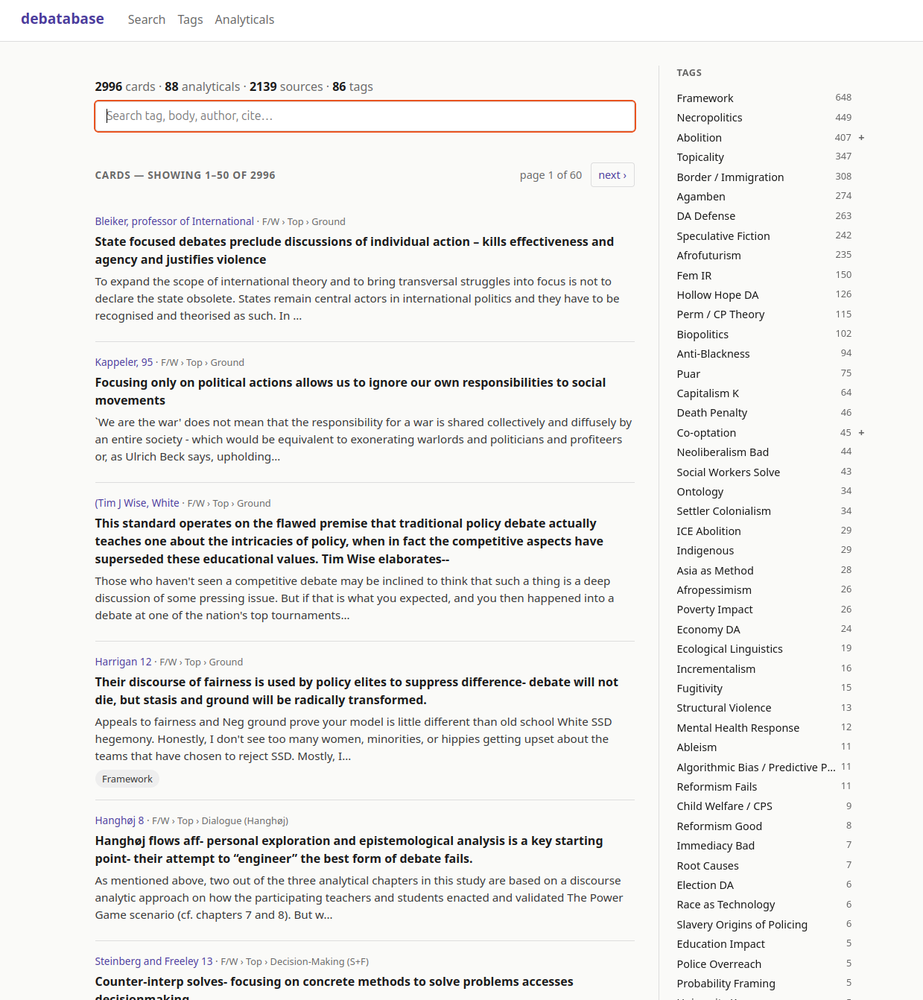

# debatabase

A searchable database of policy debate evidence cards. Built to make a personal collection of `.docx` evidence files browseable, taggable, and quickly searchable — including by author, by argument, or by full body text — with the underline/highlight distinctions that debaters care about preserved end-to-end. From there it's a prep tool: assemble cards into named speech-doc workspaces, re-highlight a card per round without touching the canonical version, and export the result back to `.docx` ready to read in Verbatim.

## What's in here

- **Postgres schema** — `sources`, `cards`, `analyticals`, an admin-curated `content_tags` vocabulary, plus join tables for both. `users` / `workspaces` / `workspace_entries` / `card_variants` for the prep side. Full-text search via `tsvector`; tag hierarchy via `parent_id`.
- **`.docx` extractor** — `python-docx`-based, with the catch that Word formatting can come from direct run properties OR from character styles (e.g. `<w:rStyle w:val="StyleUnderline"/>`). The extractor parses `styles.xml` and resolves character-style inheritance so underlines and highlights aren't silently lost.
- **`.docx` exporter** — the inverse path: workspace → `.docx` with Heading 1/2/3 hierarchy from each entry's `header_path`, the standard tag → cite-short → raw-cite Verbatim cite block, and underline/highlight runs reconstructed from the markup spans. Round-trip tested against the extractor.
- **Bulk ingest pipeline** — walks a folder of `.docx` files, segments them into cards (and analyticals — see below), auto-parses cite lines, infers content tags from keywords against a controlled vocabulary, and inserts. Successful files are moved to `parsed_docs/`.
- **Web UI** (FastAPI + Jinja2 + HTMX + Sortable.js):
  - Live search across tag / body / author / cite shorthand
  - Card detail with **render mode toggle**: full / underline-only / **highlight-only (in-round read text)** / plain
  - Hierarchical tag sidebar with collapsible parent groups
  - Pagination with result counts
  - **Workspaces** — per-user named speech-doc workspaces. Add cards or analyticals from search or card detail with one click; reorder via drag-and-drop; group entries under editable `header_path` headers; clear; export to `.docx` named after the workspace.
  - **In-browser re-highlighting** — select text in a card body inside a workspace and click highlight / underline / clear. Edits are stored as a workspace-scoped **card variant**; the canonical card is never mutated and global card detail / search continue to show the original. Revert any time.
- **Seed data** — `db_seed.sql` ships with the initial corpus already loaded (2,996 cards, 88 analyticals, 2,139 sources, 86 content tags, drawn from ~75 source documents).

## Domain glossary

If you don't debate, this vocabulary is opinionated and worth knowing up front:

- **Card** — a single quoted passage from an external source, paired with a debater-authored **tag** summarizing the argument it's being used to make. Cards have a real cite.
- **Tag** — the one-line summary above the card. *Not* the source's title — it's the cutter's editorial framing.
- **Cite** — author + year shorthand (`Roberts 19`, `Lewis & Weichselbaum 6/9`) plus a longer paragraph with author qualifications, publication, title, URL, and often a **cutter** signature (`//Armaan`, `)-Selin`, etc.). The full original cite is preserved verbatim in `sources.raw_cite`; structured fields are best-effort parses.
- **Underline** = words the cutter marked as argumentatively relevant.
- **Highlight** = the subset that gets actually *spoken in-round*. Highlight is always a subset of underline. Both are preserved as offset spans over the plain `card_text`.
- **Analytical** — a debater-authored argument with no external source, typically responding to an opposing team's claim (`AT: <claim>`). Distinct from cards (no cite) and from plan/CP/alt text (those are the team's *advocacy* and aren't stored at all). Lives in its own table with an `answer_to` field.
- **Block path** — the `Heading 1 → Heading 2 → Heading 3` structure above each card in the original speech doc (e.g. `["Aff", "1AC", "Social Workers Adv."]`). Sub-block H4s like "Scenario One: Poverty" are dropped as speech-doc-order artifacts.
- **Workspace** — a user's named speech-doc-in-progress. Holds an ordered list of cards / analyticals (`workspace_entries`), each with its own `header_path` (which the export emits as `Heading 1/2/3`). A user can have many; one is "current" and is what the `+ Add to workspace` buttons target.
- **Card variant** — a per-workspace re-cut of a card's markup. When a debater shrinks the highlight for a 2AC extension or changes the underline for a different argument, the new spans live in `card_variants` scoped to that workspace. Global card endpoints never join this table — the canonical card row is the shared, authoritative view, and edits stay private to the cutter's workspace.

## Quick start

Requires: Docker, Python 3.12+, `uv`.

```bash
# 1. Start Postgres (auto-applies schema.sql on first boot)
docker compose up -d

# 2. Load the seed data — about 30 seconds for 26 MB of inserts
docker exec -i debatabase-postgres psql -U debatabase -d debatabase < db_seed.sql

# 3. Install Python deps + run the web UI
uv sync
cp .env.example .env  # optional: add your ANTHROPIC_API_KEY for tagging tools
uv run uvicorn debatabase.web.app:app --reload
```

Open http://127.0.0.1:8000.

To start fresh without seed data, skip step 2 (the schema is applied automatically by docker-compose).

## Repository layout

```
schema.sql                          canonical Postgres DDL (no migrations tooling)
db_seed.sql                         pg_dump of the initial corpus (data only)
docker-compose.yml                  postgres:16 on host port 5433
FEATURE_ADDITIONS.md                roadmap (in-progress + planned features)
src/debatabase/
  models.py                         SQLAlchemy 2.x ORM
  db.py / config.py                 engine + settings
  parser/extract.py                 .docx → flat paragraph/run JSONL stream
  ingest.py                         insert_card / insert_analytical helpers
  bulk.py                           reusable cite parser + tag inference + map_doc
  docx_export.py                    workspace → .docx (inverse of parser/extract.py)
  markup_ops.py                     pure span-ops for the re-highlighting flow
  web/
    app.py                          FastAPI routes
    render.py                       markup-span → HTML rendering (full/highlight-only/etc.)
    templates/                      Jinja2 + HTMX
    static/style.css
scripts/
  bulk_ingest.py                    walk Evidence/ → ingest → move to parsed_docs/
  ingest_*.py                       one-shot scripts from the early per-card training session
  reingest_indexerror_docs.py       fix-up script for the trailing-H4 bug
  cleanup_cite_shorts.py            quality pass on auto-parsed cite shortcuts
tests/                              pytest suite (export round-trip + markup ops)
```

## Adding new evidence

1. Drop `.docx` files into `Evidence/` (any subdirectory structure works).
2. Run `uv run python scripts/bulk_ingest.py`. Each file is extracted, segmented, ingested, and on success moved to `parsed_docs/` (mirroring its subdirectory structure under `Evidence/`).
3. Files already represented in the DB by their `source_file` name are skipped automatically.

The pipeline is deliberately conservative on tags — it sticks to the existing controlled vocabulary plus a known list of new tag rules. Any new tag families you want should be added to `KNOWN_TAGS` and `KEYWORD_RULES` in `src/debatabase/bulk.py` first.

## Source documents

The original `.docx` source files are **not** redistributed in this repository. The seed dump contains the parsed cards (verbatim quoted text + cite metadata + markup spans), which is what's useful to debaters; the source docs themselves stay local. If you maintain your own corpus, point the bulk ingest pipeline at it and re-export `db_seed.sql` if you want to share.

## Screenshot



## Tests

```bash
uv sync --group dev
uv run pytest
```

The suite covers the `.docx` export round-trip (export → re-extract → assert spans match) and the markup-ops merge / split / normalize logic. Web routes are smoke-tested manually for now.

## Status

Personal tool, single-user (no auth — see `FEATURE_ADDITIONS.md` #6 for the IRC-style nickname/password plan). Read-side and prep-side both work end-to-end: ingest cards → search and browse → assemble into a named workspace → re-highlight per round → export `.docx`. Not deployed anywhere.

The roadmap with what's planned next lives in [`FEATURE_ADDITIONS.md`](FEATURE_ADDITIONS.md).
